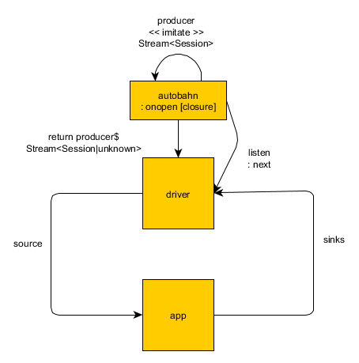

# cycle-autobahn

## Architecture

The driver takes advantage of javascript's lexical scoping in that both its listeners and producers imitate Autobahn's `session` variable that is exposed when a connection has been made via an anonymous function callback.

The source takes form of an error package upon error that has stemmed from Autobahn's API via `onclose`.

The driver is a very simple wrapper around Autobahn and is used to convert the various Autobahn context's into reactive streams using `xstream`.

## Using

## Testing

Crossbar is used in order to test the functionality of this driver.

`./crossbar.sh` is provided to run crossbar with default local settings (`.crossbar/config.json`).
